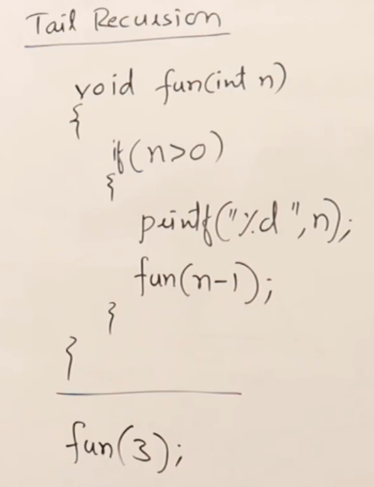
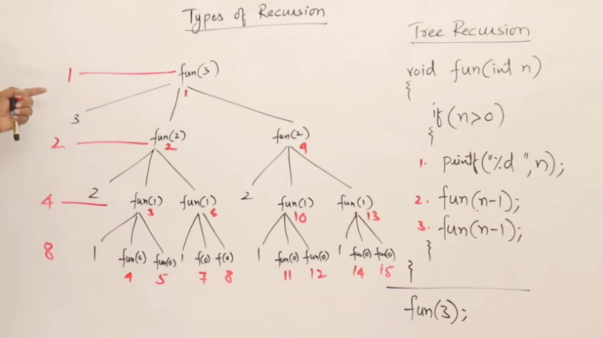
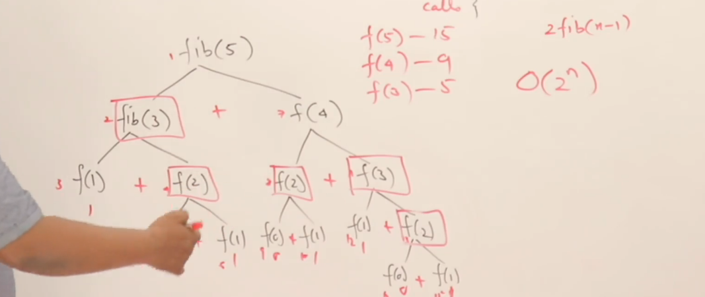
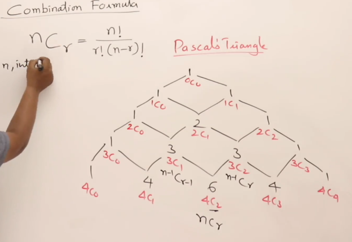

### Recursion
- A function calling itself
- Minimum requirements for recursion
  - You need to return a value
  - You need a base condition to stop
- Recursion can be controlled by statements around it
```c++
void func(int n){
    if (n > 0) {
        // called before recursion -> Also called Ascending on Recursion
        func(n-1);
        // called after recursion -> Also called Descending on Recursion
    };
}

int main(){
    int a = 5;
    func(a);
}
```
- Example: Think of turning on all lights in your home
  - You can either: (go to next room and turn on light) or (turn on light and go to next room)
  - Three rooms and three prints => order of printing can be `1,2,3` (ascending) or `3,2,1` (descending)

**Time and Space Complexity**
- Every recursive action creates a new entry on the stack and takes n+1 operations (base case + n cases)
- Hence space complexity is O(n+1) or O(n)
- Time complexity is number of calls to recursive function -> O(n)

**Static and Global Variables in Recursion**

Static or Global Variables are variables that belong in global scope and are shared among all functions

Consider the following recursive code

```c++
int fun(int n){
    static int x = 0;
    if (n > 0){
        x++;
        return fun(n-1)+x;
    }
    return 0;
}

int main(){
    int a = 5;
    cout << fun(a) << endl;
}
```

- Static value of x is created in the code section, not on the main or other functions on stack
- The output of the code above would result in the following steps
```
fun(5)+x -> fun(4)+x -> fun(3)+x -> fun(2)+x ->  fun(1)+x  <- Return from here
  \           \           \           \           \      ^
   V           V           V           V           V      \  
   increase x  increase x  increase x  increase x  increase x  
```
- Now the return starts with x= 5
  - (((fun(0) + 5) => fun(1) + 5) => fun(2) + 5) ..
- hence output is fun(5) + 5 = 25

#### Types of Recursion
- Tail Recursion
- head recursion
- Tree recursion
- Indirect recursion
- nested recursion

**Tail Recursion**: All executions are done before the recursion call


- Tail recursions are easily converted into loops
- A lot of compilers during code optimization do this

**Comparing tail recursion to loops**
- In terms of time complexity, tail recursion is the same as loops
- In terms of space complexity, loops are more efficient as you do not create a stack for every call

**head recursion**: All executions are done after the function call
Example:
```c++
void fun(int n){
    if (n>0){
        fun(n-1);
        cout << n << endl; //post rec processing
    }
}
```
- Head recursions are more difficult to convert to loops but can be done
- You need to modify the loop to perform the operations after returning

**Linear and tree recursions**
- If a recursive function calls itself once it is called linear recursion
- If a function calls itself more than once on each iteration it is called tree recursion

Example:
```c++
void fun1(int n){
    if (n>0){
    //
    fun(n-1);
    //
    }
}

void fun2(int n){
    if (n>0){
      //
      fun(n-1);
      //
      fun(n-1);
      //
    }
}
```
- Note the execution of tree recursions and how many calls are made of fun2



- The number of calls made are `2^n -1` -> time complexity is O(2^n)
- Space complexity is o(n) as max height of stack is n

**Indirect recursion**
- In indirect recursion, fun1 calls fun2 and fun2 calls fun1
Example

```c++
void fun1(int n){
    if (n>0){
        fun2(n-1);
        cout << n << endl;
    }
}

void fun2(int n){
    if (n>0){
        fun1(n-1);
        cout << n << endl; 
    }
}

int main(){
    int a = 3;
    fun1(a);
}
```

**Nested Recursion**
- In the recursive call you call the function more than once, that creates a nested cycle
```c++
void fun1(int n){
    if (n>0){
        cout << n << endl;
        return fun1(fun1(n))
    }
}
```

#### Practice Recursion and programming
- Sum on N natural numbers
```c++
int sum_n(int n){
    if (n==0){
        return 0;
    }
    return sum_n(n-1) + n;
}
```

- Power calculation
```c++
int exp_n(int a, int b){
    if (b == 1){
        return a;
    }
    return exp_n(a, b-1) * a;
}

int exp_n_faster(int a, int b){
    if (b==1){
        return a;
    }
    else if (b % 2 == 0){
        return exp_n_faster(a*a, b/2);
    }
    else{
        return exp_n_faster(a*a, (b-1)/2) * a;
    }
}
```

- Taylor Series
- We know taylor series is given as e^x = 1 + x/1 + (x^2)/2 + (x^3)/3 + .... n terms
- Calculation of Taylor Series needs the combination of sum, power and factorial problems all combined into one call

```c++
double taylor_series(int x, int n){
    static double p=1,f=1;
    double r;
    if (n == 0){
        return 1;
    }
    else {
        r = taylor_series(x, n-1);
        p = p * x;
        f = f * n;
        return  r + (p/f);
    }
}

double ts_homer_rule(int x, int n){
    static double r=1;
    if (n == 0){
        return r;
    }
    r = 1 + x*r/n;
    return ts_homer_rule(x, n-1);
}
```

**Fibonacci series**
The simplest recursive call is 
```c++
int fib(int n){
    if (n<=1){
        return n;
    }
    return fib(n-2) + fib(n-1);
}
```

**Memoization**
- If you look at the fibonacci function that uses recursion, it makes O(2^n) calls -> called excessive recursion
- An iterative fibonacci instead make O(n) calls 



- Let us try saving the outputs of each function call -> Memoization
- Here we only calculate the fib of n if F[n] is -1
```c++
int F[10];

int fib_memo(int n){
    //cout << n << endl;
    if (n <= 1){
        F[n] = n;
        return n;
    }
    else{
        if (F[n-2] == -1){
            F[n-2] = fib_memo(n-2);
        }
        if (F[n-1] == -1){
            F[n-1] = fib_memo(n-1);
        }
        F[n] = F[n-2] + F[n-1];
        return F[n];
    }
}
```

**Combination using recursion**
- The formula is nCr = n! / r!(n-r)!
- you can now calculate the value of nCr by pascal's triangle



- Here we can see that every nCr value is the sum of (n-1)C(r-1) + (n-1)Cr

```c++

```